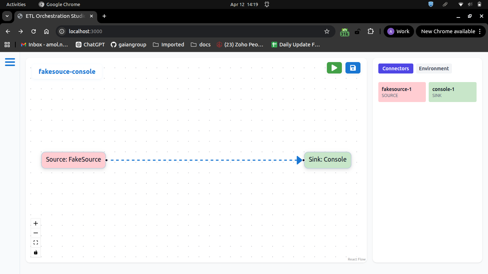

https://amol64546.github.io/etl-orchestration-studio/   
https://seatunnel-orchestrator-1-0-0.onrender.com/swagger-ui/index.html#/
https://seatunnel-2-3-12.onrender.com

# Issues
- stop pipeline

# Features need to be implemented
- start and stop job with save point

- button to start with new in pipeline builder
- schema field should have nested field selection
- save/unsave pipeline status

- search pipeline and connector
- Authentication

